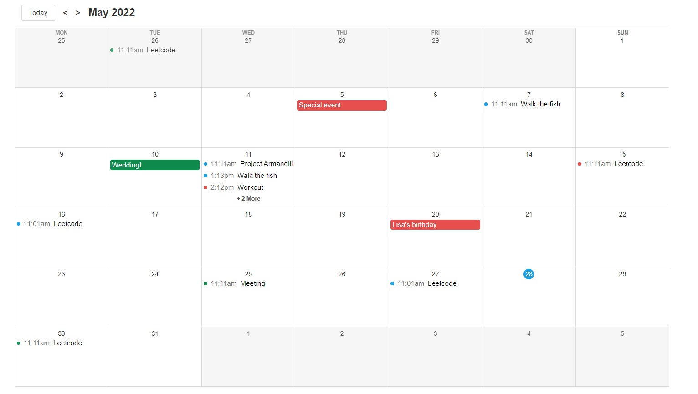

# CalendarJS

This project was challanging to build with only pure javascript. Using a front-end framework like React or Angular could have made it a lot easier, but that was not the point of this exercise.
The main goal was to polish and really challange my javascript skills.

---

---

### [See live version](https://calendarjs-app.netlify.app/)

### Description

This CalendarJS app is a free-to-use seemingly simple web application, but with advanced features.  
Users can add events and those events will be saved to local storage, so they can re-visit the site and still see their events. Events can be updated and deleted when clicking on them.
CalendarJS utilizes a 2 great third-party libraries called Date-FNS and UUID, and the core file architecture is based on the so-called MVC model.

### Features

- Users are seeing the current month and date on page load
- Users can add all-day and time specified events when hovering a day and clicking on the '+' button
- Users can edit and delete events
- Events are saved to local storage, so they can revisit the site and still see their events
- Events can not overflow, if they would reach outside the parent container a 'See More +2' button will appear instead

### Architecture

MVC (Model-View-Controller) is a pattern in software design commonly used to implement user interfaces, data, and controlling logic. It emphasizes the separation between the software's business logic and display. This "separation of concerns" provides a better division of labor and improved maintenance.

### Technologies used

- HTML5
- CSS3
- Javascript
- Parcel
- NPM
- UUID
- Date-FNS

### What did I learn?

This project helped me improve my skills in multiple areas.

- I got more comfortable using npm and installing third-party libraries to accelarate my workflow. I used UUID for generating uniqe IDs and Date-FNS to make working with dates easier. These libraries were really great to work with!
- I was forced to manage 'state' in vanilla javascript.
- Taking advantage of the short circuting abilities of && and || instead of using the ternary operator.
- The biggest challange was to calculate if the events of a day are overflowing or not, and then dynamically displaying the 'Show More +2' button

### Credit

_The project was inspired by [Kyle](https://courses.webdevsimplified.com/)_
